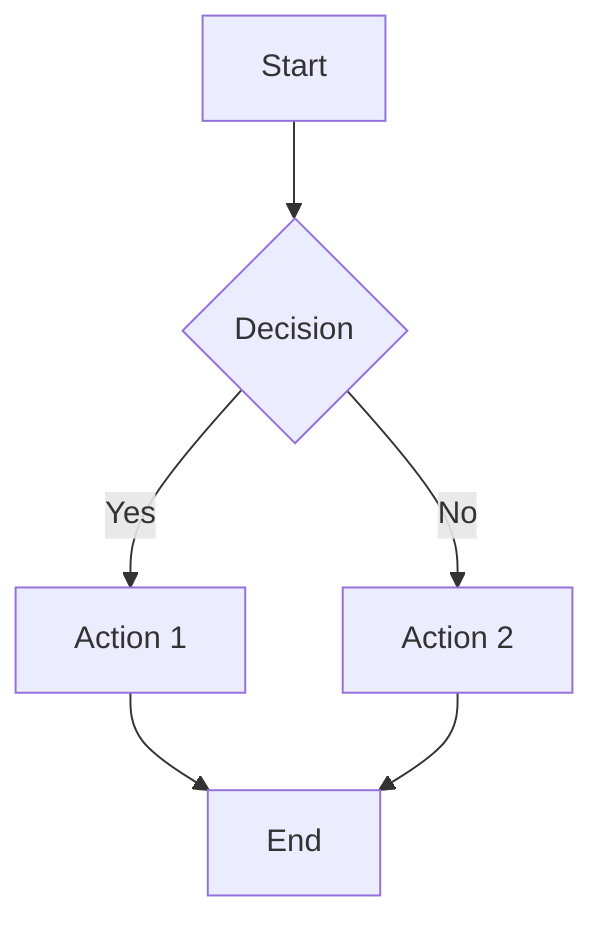
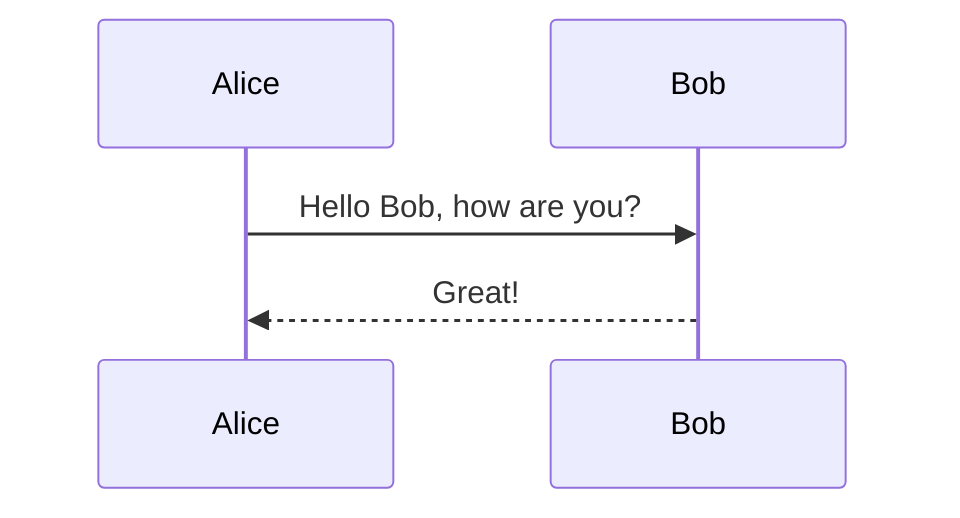
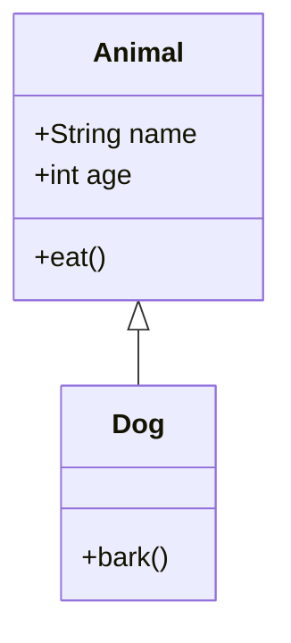

# Mermalaid - The #1 Free Mermaid Diagram Editor | 100% Open Source & Free

**Mermalaid** is the premier free, open-source Mermaid diagram editor and chart creator. Create unlimited Mermaid diagrams, flowcharts, sequence diagrams, and more—completely free, no restrictions, no sign-ups required. The best free alternative to paid Mermaid editors.

[](https://creativecommons.org/licenses/by-nc-sa/4.0/)
[](LICENSE)
[]()

## 🎯 Why Mermalaid? The Best Free Mermaid Editor

Looking for a **free Mermaid editor**? Tired of **Mermaid diagram tools** with limits, subscriptions, or hidden costs? **Mermalaid is completely free and open source**—no document limits, no premium features, no credit cards required.

### Key Differentiators

- ✅ **100% Free** - No restrictions, no limits, free forever (free as in free beer 🍺)
- ✅ **Completely Open Source** - Full source code available, modify as you need
- ✅ **No Sign-Up Required** - Start creating Mermaid diagrams instantly
- ✅ **Unlimited Diagrams** - Create as many Mermaid charts as you need
- ✅ **Professional Features** - Live preview, visual editor, syntax highlighting, SVG/PNG/ASCII export
- ✅ **Web & Desktop** - Use in browser or download native macOS app
- ✅ **Privacy-First** - All data stays local, no cloud sync required

## 🚀 Quick Start - Create Your First Mermaid Diagram

### Use Online (Web Version)

Visit [Mermalaid](https://mermalaid.com) to start creating Mermaid diagrams instantly in your browser—no installation needed.

### Download Desktop App (macOS)

1. Download the latest release from [GitHub Releases](https://github.com/highvoltag3/mermalaid/releases)
2. Install the `.dmg` file
3. Start creating unlimited free Mermaid diagrams

## ✨ Features - Professional Mermaid Editor, Zero Cost

Mermalaid provides professional-grade features typically found in paid Mermaid editors—all completely free:

### Editor Features

- **Monaco Editor** with syntax highlighting for Mermaid code
- **Live Preview** with debounced updates (500ms) - See changes in real-time
- **Visual Editor** - Drag-and-drop flowcharts with React Flow; switch to visual mode for supported diagrams
- **Real-time Syntax Validation** - Instant error detection and feedback
- **Auto-save** to localStorage - Never lose your work
- **Dark/Light Mode** - Work in your preferred theme
- **beautiful-mermaid Themes** - Multiple themes (GitHub Light/Dark, Tokyo Night, Catppuccin, Dracula, Nord, and more) that style both diagrams and the app UI
- **Toast Notifications** - Clear feedback for actions (save, export, errors)
- **AI Syntax Fix** - Copy-pasted the diagram from somewhere but it has syntax errors? 🤖 Let AI fix it ✨ for you. (**You will need an OpenAI API key, it's __stored locally__ in your machine so it's only yours**).

### File Management

- **Open Files** - Import `.mmd`, `.txt`, or `.md` files with Mermaid code
- **Save Diagrams** - Export your Mermaid diagrams to local files
- **Export Options**:
  - **SVG Export** - Vector graphics for presentations and documents
  - **PNG Export** - Raster images for documentation and web use
  - **ASCII Export** - Unicode box-drawing for terminals (flowcharts, state, sequence, class, ER diagrams)
- **Copy to Clipboard** - Export code blocks ready for Markdown, GitHub, or documentation

### Mermaid Diagram Types Supported

Create unlimited diagrams of all types:

- **Flowcharts** (`graph`, `flowchart`)
- **Sequence Diagrams** (`sequenceDiagram`)
- **Class Diagrams** (`classDiagram`, `classDiagram-v2`)
- **State Diagrams** (`stateDiagram`, `stateDiagram-v2`)
- **Entity Relationship Diagrams** (`erDiagram`)
- **User Journey** (`journey`)
- **Gantt Charts** (`gantt`)
- **Pie Charts** (`pie`)
- **Git Graphs** (`gitGraph`)
- **And More** - Full Mermaid.js support

### Cross-Platform Support

- **Web Application** - Works in any modern browser
- **Native macOS App** - Lightweight desktop application
- **Static Hosting** - Deploy anywhere (Vercel, Netlify, Appwrite Sites, etc.)

## 💻 Technical Excellence

### Built with Modern Technologies

- **Tauri** - Lightweight, secure, native desktop framework (~10MB vs ~100MB+ Electron apps)
- **React** + **TypeScript** - Modern, type-safe UI development
- **Monaco Editor** - The same editor that powers VS Code
- **beautiful-mermaid** - Beautiful, themed Mermaid diagram rendering with customizable themes
- **@xyflow/react** - Visual editor for drag-and-drop flowchart editing

### Why Tauri?

Mermalaid uses Tauri instead of Electron for a superior experience:

- 🚀 **Much smaller app size** (~10MB vs ~100MB+ for Electron)
- ⚡ **Better performance** using system webview instead of bundled Chromium
- 🔒 **Enhanced security** with Rust backend
- 💰 **Lower memory usage** - Runs efficiently on any machine
- 🎯 **Better native integration** - Feels like a real macOS app

## 📚 Use Cases - When to Use Mermalaid

Mermalaid is perfect for:

- **Software Developers** - Document architecture, workflows, and system designs
- **Technical Writers** - Create diagrams for documentation and tutorials
- **Project Managers** - Visualize project flows and processes
- **Students** - Create diagrams for assignments and presentations
- **DevOps Engineers** - Document infrastructure and deployment pipelines
- **Anyone** - Who needs to create Mermaid diagrams without limits or costs

## 🎨 Example Mermaid Diagrams

Try these examples in Mermalaid:

### Flowchart Example



### Sequence Diagram Example



### Class Diagram Example



## 🔧 Development & Installation

### Prerequisites

- Node.js 18+
- Rust (Tauri will install automatically if not present)
- macOS (for building macOS apps)

### Running in Development

```bash
# Install dependencies
npm install

# Run Tauri in development mode (desktop app)
npm run tauri:dev

# Or run web version only
npm run dev
```

This will:
1. Start the Vite dev server on `http://localhost:5173`
2. Launch Tauri with the development server (if using desktop)
3. Hot reload your React app

### Building for Production

```bash
# Build web assets
npm run build

# Build macOS desktop app
npm run tauri:build
```

The built app will be in `src-tauri/target/release/bundle/`:
- `.app` file for macOS
- `.dmg` installer

### Installing the Desktop App

**Important:** The app is currently unsigned (not code-signed). macOS may show a "damaged" warning when you first open it.

**Recommended Installation Method:**
```bash
# 1. Copy the app from the DMG to Applications
cp -R /Volumes/Mermalaid_*/Mermalaid.app /Applications/

# 2. Remove quarantine attribute
xattr -cr /Applications/Mermalaid.app

# 3. Open the app
open /Applications/Mermalaid.app
```

**Alternative: System Settings**
1. Open **System Settings** → **Privacy & Security**
2. Scroll down to see the blocked app message
3. Click **"Open Anyway"** next to the Mermalaid warning
4. Click **"Open"** in the confirmation dialog

## ⌨️ Keyboard Shortcuts

- `⌘N` (Mac) / `Ctrl+N` (Windows/Linux): New diagram
- `⌘O` / `Ctrl+O`: Open file
- `⌘S` / `Ctrl+S`: Save file

## 🤝 Contributing

Mermalaid is open source and welcomes contributions! See [CONTRIBUTING.md](CONTRIBUTING.md) for guidelines.

Areas where contributions are especially welcome:
- Additional Mermaid diagram types
- Export formats (PDF, etc.)
- Platform support (Windows, Linux)
- Performance improvements
- Documentation and examples

## 📖 Documentation

- [Contributing Guide](CONTRIBUTING.md) - How to contribute to Mermalaid
- [Project Structure](PROJECT_STRUCTURE.md) - Codebase organization and file structure
- [Deployment Guide](DEPLOYMENT.md) - Deploy Mermalaid web version
- [Appwrite Setup](APPWRITE_SETUP.md) - Step-by-step Appwrite Sites setup
- [Static Hosting](STATIC_HOSTING.md) - Hosting configuration details

## 🐛 Troubleshooting

**Tauri won't start:**
- Make sure Rust is installed: `rustc --version`
- Tauri will prompt to install Rust if missing
- Check that port 5173 is available for dev server

**Build fails:**
- Ensure you've run `npm run build` first
- Check that `dist/` directory exists with built files
- On macOS, you may need to allow the app in Security & Privacy settings

**App size concerns:**
- Tauri apps are much smaller than Electron (~10MB vs ~100MB+)
- First build may take longer as Rust compiles dependencies

## 📄 License

This work is licensed under a [Creative Commons Attribution-NonCommercial-ShareAlike 4.0 International License](http://creativecommons.org/licenses/by-nc-sa/4.0/).

**CC BY-NC-SA 4.0** - Free to use, modify, and share (non-commercial)

## 🌟 Why Choose Mermalaid Over Other Mermaid Editors?

| Feature | Mermalaid | Other Tools |
|---------|-----------|-------------|
| **Cost** | ✅ 100% Free | ❌ Free tier with limits, paid for unlimited |
| **Open Source** | ✅ Yes, fully open | ❌ Usually closed source |
| **Document Limits** | ✅ Unlimited | ❌ Often 3-5 documents max |
| **Sign-Up Required** | ✅ No | ❌ Usually required |
| **Privacy** | ✅ Local storage only | ❌ Cloud sync required |
| **Export Options** | ✅ SVG, PNG, ASCII | ✅/❌ Varies |
| **Syntax Validation** | ✅ Real-time | ✅/❌ Varies |
| **Desktop App** | ✅ Native macOS | ❌ Often web-only |
| **Visual Editor** | ✅ Yes (flowcharts) | ❌ Usually code-only |

## 🎯 SEO Keywords & Search Terms

Mermalaid is optimized for these search terms:
- **free mermaid editor**
- **mermaid diagram editor free**
- **open source mermaid editor**
- **free mermaid chart creator**
- **mermaid diagram tool free**
- **online mermaid editor free**
- **mermaid flowchart editor**
- **free mermaid diagram generator**
- **mermaid editor no sign up**
- **best free mermaid tool**

---

**⭐ Star this repo** if you find Mermalaid useful for creating free, unlimited Mermaid diagrams!

**🔗 Share Mermalaid** with others who need a completely free, open-source Mermaid editor.

**💬 Have questions?** Open an issue or check our documentation.

---

*Mermalaid - The #1 Free Mermaid Diagram Editor. Completely Open Source. 100% Free. Forever.*
