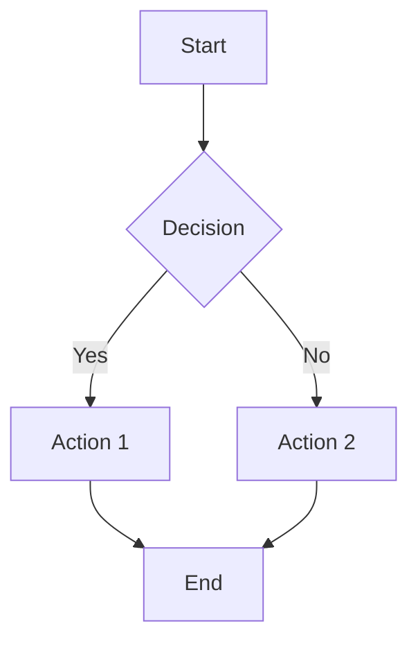
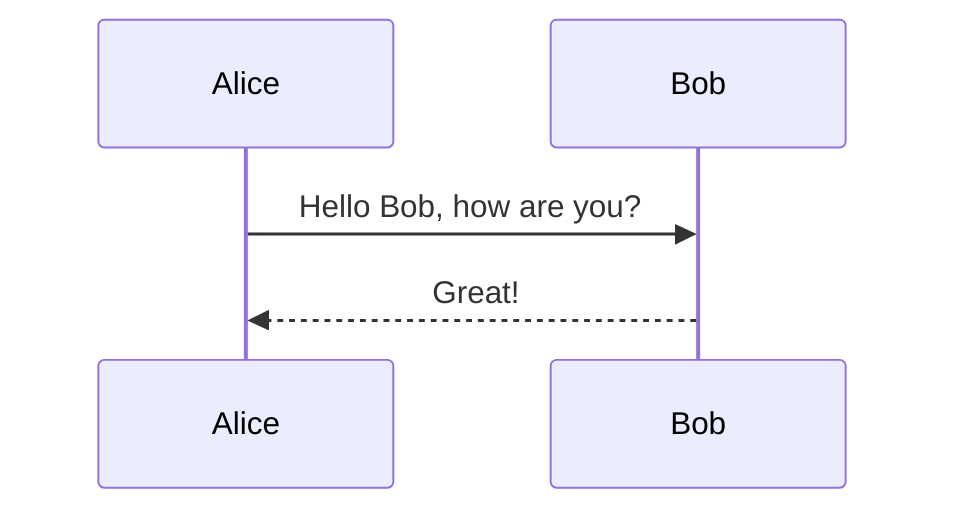
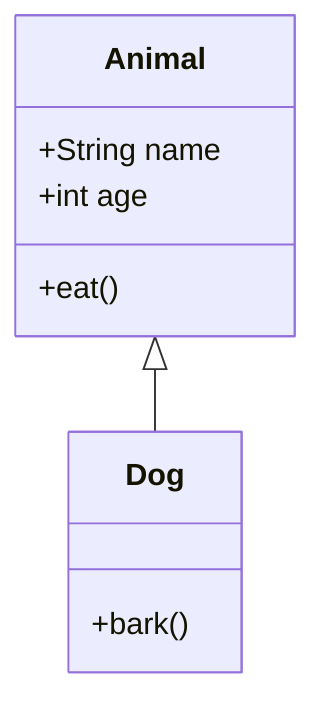

# Mermalaid - Free Mermaid Diagram Editor | Source-available

**Mermalaid** helps you create Mermaid diagrams faster, without paywalls or sign-ups. Build flowcharts, sequence diagrams, class diagrams, and more with live preview and visual editing. The source code is available under CC BY-NC-SA 4.0 (non-commercial).

[](https://creativecommons.org/licenses/by-nc-sa/4.0/)
[](LICENSE)
[]()

## 🎯 Why Mermalaid

If you need a **free Mermaid editor** without limits, subscriptions, or account walls, Mermalaid is built for you. It stays free and source-available, with no document caps and no premium lock-in.

### Key Differentiators

- ✅ **100% Free** - No usage limits, no hidden fees, no premium upsell
- ✅ **Source-available Codebase** - Full source under CC BY-NC-SA 4.0 (non-commercial)
- ✅ **No Sign-Up Required** - Open the editor and start diagramming instantly
- ✅ **Unlimited Diagrams** - Create as many Mermaid charts as you need
- ✅ **Professional Features** - Live preview, visual editor, syntax checks, and flexible export
- ✅ **Web & Desktop** - Use it in your browser or as a native macOS app
- ✅ **Privacy-First** - Your diagrams stay local on your device

## 🚀 Quick Start - Create Your First Mermaid Diagram

### Use Online (Web Version)

Visit [Mermalaid](https://mermalaid.com) to start creating Mermaid diagrams instantly in your browser—no installation needed.

### Download Desktop App (macOS)

1. Download the latest release from [GitHub Releases](https://github.com/highvoltag3/mermalaid/releases)
2. Install the `.dmg` file
3. Start creating unlimited free Mermaid diagrams

## ✨ Features - Professional Editor, Zero Cost

Mermalaid includes the features teams usually pay for, while staying free to use:

### Editor Features

- **Monaco Editor** - Write Mermaid with robust syntax highlighting
- **Live Preview** - See updates in real time with smooth debounced rendering (500ms)
- **Visual Editor** - Drag and connect flowchart nodes, then sync changes back to code
- **Real-time Syntax Validation** - Catch errors early and fix faster
- **Auto-save** - Keep work in local storage so progress is not lost
- **Dark/Light Mode** - Work comfortably in your preferred theme
- **beautiful-mermaid Themes** - Style both diagrams and app UI with curated themes
- **Toast Notifications** - Get clear feedback for save, export, and error actions
- **AI Syntax Fix** - Fix broken Mermaid syntax quickly using your own OpenAI API key (stored locally on your machine)

### File Management

- **Open Files** - Import `.mmd`, `.txt`, or `.md` files
- **Save Diagrams** - Export Mermaid diagrams to local files
- **Export Options**:
  - **SVG Export** - Vector graphics for presentations and documents
  - **PNG Export** - Raster images for documentation and web use
  - **ASCII Export** - Unicode box-drawing for terminals (flowcharts, state, sequence, class, ER diagrams)
- **Copy to Clipboard** - Copy Markdown-ready Mermaid blocks for docs and GitHub

### Mermaid Diagram Types Supported

Create diagrams across the full Mermaid ecosystem:

- **Flowcharts** (`graph`, `flowchart`)
- **Sequence Diagrams** (`sequenceDiagram`)
- **Class Diagrams** (`classDiagram`, `classDiagram-v2`)
- **State Diagrams** (`stateDiagram`, `stateDiagram-v2`)
- **Entity Relationship Diagrams** (`erDiagram`)
- **User Journey** (`journey`)
- **Gantt Charts** (`gantt`)
- **Pie Charts** (`pie`)
- **Git Graphs** (`gitGraph`)
- **And More** - Broad Mermaid.js coverage

### Cross-Platform Support

- **Web Application** - Works in any modern browser
- **Native macOS App** - Lightweight desktop application
- **Static Hosting** - Deploy anywhere (Vercel, Netlify, Appwrite Sites, etc.)

## 💻 Technical Excellence

### Built with Modern Technologies

- **Tauri** - Lightweight, secure, native desktop framework (~10MB vs ~100MB+ Electron apps)
- **React** + **TypeScript** - Modern, type-safe UI development
- **Monaco Editor** - The same editor that powers VS Code
- **beautiful-mermaid** - Beautiful, themed Mermaid diagram rendering with customizable themes
- **@xyflow/react** - Visual editor for drag-and-drop flowchart editing

### Why Tauri?

Mermalaid uses Tauri instead of Electron for a superior experience:

- 🚀 **Much smaller app size** (~10MB vs ~100MB+ for Electron)
- ⚡ **Better performance** using system webview instead of bundled Chromium
- 🔒 **Enhanced security** with Rust backend
- 💰 **Lower memory usage** - Runs efficiently on any machine
- 🎯 **Better native integration** - Feels like a real macOS app

## 📚 Use Cases - When to Use Mermalaid

Mermalaid works well for:

- **Software Developers** - Document architecture, workflows, and system design
- **Technical Writers** - Add clear diagrams to docs and tutorials
- **Project Managers** - Visualize processes and delivery plans
- **Students** - Create diagrams for assignments and presentations
- **DevOps Engineers** - Map infrastructure and deployment pipelines
- **Anyone** - Build Mermaid diagrams without limits or subscriptions

## 🎨 Example Mermaid Diagrams

Try these examples in Mermalaid:

### Flowchart Example


```mermaid
graph TD
    A[Start] --> B{Decision}
    B -->|Yes| C[Action 1]
    B -->|No| D[Action 2]
    C --> E[End]
    D --> E
```

### Sequence Diagram Example


```mermaid
sequenceDiagram
    Alice->>Bob: Hello Bob, how are you?
    Bob-->>Alice: Great!
```

### Class Diagram Example


```mermaid
classDiagram
    class Animal {
        +String name
        +int age
        +eat()
    }
    class Dog {
        +bark()
    }
    Animal <|-- Dog
```

## 🔧 Development & Installation

### Prerequisites

- Node.js 18+
- Rust (Tauri will install automatically if not present)
- macOS (for building macOS apps)

### Running in Development

```bash
# Install dependencies
npm install

# Run Tauri in development mode (desktop app)
npm run tauri:dev

# Or run web version only
npm run dev
```

This will:
1. Start the Vite dev server on `http://localhost:5173`
2. Launch Tauri with the development server (if using desktop)
3. Hot reload your React app

### Building for Production

```bash
# Build web assets
npm run build

# Build macOS desktop app
npm run tauri:build
```

The built app will be in `src-tauri/target/release/bundle/`:
- `.app` file for macOS
- `.dmg` installer

### Installing the Desktop App

**Important:** The app is currently unsigned (not code-signed). macOS may show a "damaged" warning when you first open it.

**Recommended Installation Method:**
```bash
# 1. Copy the app from the DMG to Applications
cp -R /Volumes/Mermalaid_*/Mermalaid.app /Applications/

# 2. Remove quarantine attribute
xattr -cr /Applications/Mermalaid.app

# 3. Open the app
open /Applications/Mermalaid.app
```

**Alternative: System Settings**
1. Open **System Settings** → **Privacy & Security**
2. Scroll down to see the blocked app message
3. Click **"Open Anyway"** next to the Mermalaid warning
4. Click **"Open"** in the confirmation dialog

## ⌨️ Keyboard Shortcuts

- `⌘N` (Mac) / `Ctrl+N` (Windows/Linux): New diagram
- `⌘O` / `Ctrl+O`: Open file
- `⌘S` / `Ctrl+S`: Save file

## 🤝 Contributing

Mermalaid is source-available and welcomes contributions! See [CONTRIBUTING.md](CONTRIBUTING.md) for guidelines.

Areas where contributions are especially welcome:
- Additional Mermaid diagram types
- Export formats (PDF, etc.)
- Platform support (Windows, Linux)
- Performance improvements
- Documentation and examples

## 📖 Documentation

- [Contributing Guide](CONTRIBUTING.md) - How to contribute to Mermalaid
- [Project Structure](PROJECT_STRUCTURE.md) - Codebase organization and file structure
- [Deployment Guide](DEPLOYMENT.md) - Deploy Mermalaid web version
- [Appwrite Setup](APPWRITE_SETUP.md) - Step-by-step Appwrite Sites setup
- [Static Hosting](STATIC_HOSTING.md) - Hosting configuration details

## 🐛 Troubleshooting

**Tauri won't start:**
- Make sure Rust is installed: `rustc --version`
- Tauri will prompt to install Rust if missing
- Check that port 5173 is available for dev server

**Build fails:**
- Ensure you've run `npm run build` first
- Check that `dist/` directory exists with built files
- On macOS, you may need to allow the app in Security & Privacy settings

**App size concerns:**
- Tauri apps are much smaller than Electron (~10MB vs ~100MB+)
- First build may take longer as Rust compiles dependencies

## 📄 License

This work is licensed under a [Creative Commons Attribution-NonCommercial-ShareAlike 4.0 International License](http://creativecommons.org/licenses/by-nc-sa/4.0/).

**CC BY-NC-SA 4.0** - Free to use, modify, and share for non-commercial use.

Because this license includes a non-commercial clause, Mermalaid is source-available rather than OSI open source.

## 🌟 Why Choose Mermalaid Over Other Mermaid Editors?

| Feature | Mermalaid | Other Tools |
|---------|-----------|-------------|
| **Cost** | ✅ 100% Free | ❌ Free tier with limits, paid for unlimited |
| **Source-available** | ✅ Yes (CC BY-NC-SA 4.0, non-commercial) | ❌ Usually closed source |
| **Document Limits** | ✅ Unlimited | ❌ Often 3-5 documents max |
| **Sign-Up Required** | ✅ No | ❌ Usually required |
| **Privacy** | ✅ Local storage only | ❌ Cloud sync required |
| **Export Options** | ✅ SVG, PNG, ASCII | ✅/❌ Varies |
| **Syntax Validation** | ✅ Real-time | ✅/❌ Varies |
| **Desktop App** | ✅ Native macOS | ❌ Often web-only |
| **Visual Editor** | ✅ Yes (flowcharts) | ❌ Usually code-only |

---

**⭐ Star this repo** if you find Mermalaid useful for creating free, unlimited Mermaid diagrams!

**🔗 Share Mermalaid** with others who need a completely free, source-available Mermaid editor.

**💬 Have questions?** Open an issue or check our documentation.

---

*Mermalaid - Free Mermaid Diagram Editor. Source-available. 100% free. Forever.*
