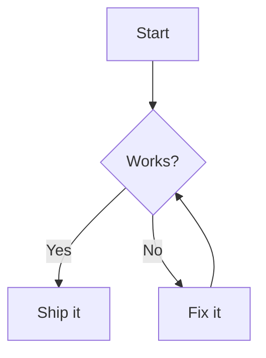

# Mermalaid for Slack

Render [Mermaid.js](https://mermaid.js.org) diagrams right inside Slack. Run
`/mermalaid`, paste your diagram code into the dialog, and Mermalaid renders it
to a PNG and posts it in the channel.

This is the equivalent of [mermaid-preview.com](https://mermaid-preview.com),
built on Mermalaid's own rendering and deployed as **Vercel serverless
functions + headless Chromium** — the diagram content is rendered inside your
own function and never sent to a third-party service.

```
/mermalaid
  → opens a modal (paste code + pick a theme)
  → server renders the diagram to PNG with headless Chromium
  → PNG is uploaded and shared into the channel
```

## Architecture

| Piece | Path |
| --- | --- |
| Slash command endpoint (opens the modal) | [`api/slack/commands.ts`](../api/slack/commands.ts) |
| Interactivity endpoint (renders + posts) | [`api/slack/interactions.ts`](../api/slack/interactions.ts) |
| Headless Chromium renderer | [`api/_lib/renderMermaid.ts`](../api/_lib/renderMermaid.ts) |
| Slack Web API client (upload flow) | [`api/_lib/slackApi.ts`](../api/_lib/slackApi.ts) |
| Request signature verification | [`api/_lib/slackVerify.ts`](../api/_lib/slackVerify.ts) |
| Modal builder + submission parser | [`api/_lib/modal.ts`](../api/_lib/modal.ts) |
| App manifest | [`slack/manifest.json`](./manifest.json) |
| Landing page | `/slack` route ([`src/components/SlackLandingPage.tsx`](../src/components/SlackLandingPage.tsx)) |

Because Slack requires a response within 3 seconds and a cold Chromium render
takes longer, the modal submission is acknowledged immediately (the modal
closes) and the render + upload run as background work via Vercel's
[`waitUntil`](https://vercel.com/docs/functions/functions-api-reference#waituntil).
If the render fails (e.g. a syntax error) or the bot can't post to the channel,
the error is reported back to the user privately via the slash command's
`response_url`, which works even when the bot isn't a channel member.

**Security / limits:** diagrams are rendered with Mermaid's `strict` security
level (HTML/script in labels is sanitized) and the render browser is blocked
from making any network requests, so untrusted diagram markup can't execute
script or trigger server-side requests (SSRF). Submitted source is capped at
12,000 characters, and each render is bounded by a 25s timeout. There is no
per-user rate limiting yet — see "single workspace first" below.

## Setup (single workspace)

You need a Slack workspace where you can install an app, and this repo deployed
to Vercel (or another host that runs the `/api` functions).

### 1. Deploy so you have a public URL

Deploy this repo to Vercel as usual. Your functions will be available at:

- `https://<your-domain>/api/slack/commands`
- `https://<your-domain>/api/slack/interactions`

(You can set the Slack env vars in step 4 and redeploy — the URLs exist as soon
as the project is deployed.)

### 2. Create the Slack app from the manifest

1. Go to <https://api.slack.com/apps> → **Create New App** → **From a manifest**.
2. Pick your workspace.
3. Paste the contents of [`slack/manifest.json`](./manifest.json), **replacing
   both `YOUR_DOMAIN`** occurrences with your deployed domain.
4. Create the app.

The manifest requests these bot scopes:

| Scope | Why |
| --- | --- |
| `commands` | Register the `/mermalaid` slash command |
| `chat:write` | Post messages / ephemeral error notices |
| `chat:write.public` | Post to public channels the bot hasn't joined |
| `files:write` | Upload the rendered PNG |
| `channels:join` | Auto-join a public channel so the file share succeeds |

### 3. Install to your workspace

In the app settings, go to **Install App** → **Install to Workspace** and
approve. Copy:

- **Bot User OAuth Token** (`xoxb-…`) → `SLACK_BOT_TOKEN`
- **Signing Secret** (Basic Information → App Credentials) → `SLACK_SIGNING_SECRET`

### 4. Set environment variables

In Vercel → Project → **Settings → Environment Variables**, add:

```
SLACK_BOT_TOKEN=xoxb-…
SLACK_SIGNING_SECRET=…
```

Redeploy so the functions pick them up.

### 5. Test

In any Slack channel, run:

```
/mermalaid
```

Paste a diagram, choose a theme, and hit **Render**:



A rendered PNG should appear in the channel within a few seconds.

## Local development

Rendering works locally against a system Chrome (no `@sparticuz/chromium`
needed). The renderer auto-detects the standard macOS Chrome path, or set
`PUPPETEER_EXECUTABLE_PATH`.

To exercise the Slack endpoints locally you need a public HTTPS tunnel to your
machine so Slack can reach them:

```bash
# Terminal 1 — run the Vercel dev server (serves /api functions)
npx vercel dev

# Terminal 2 — expose it (any tunnel works)
npx ngrok http 3000
```

Point the slash-command URL and interactivity request URL in your Slack app
settings at `https://<tunnel-host>/api/slack/…`, and put your Slack env vars in
a local `.env` (see [`.env.example`](../.env.example)).

You can also render a diagram straight to a PNG file without Slack, to check the
renderer:

```bash
node scripts/render-mermaid-sample.mjs "graph TD; A-->B" out.png
```

## Themes

The modal offers Mermaid's built-in themes: **Default**, **Dark**, **Forest**,
and **Neutral**. Dark renders on a dark background; the others on white.

## Troubleshooting

| Symptom | Fix |
| --- | --- |
| `Invalid request signature` (401) | `SLACK_SIGNING_SECRET` is wrong or missing. |
| Modal opens but nothing is posted | Check the function logs. Common causes: the bot isn't in a **private** channel (invite it), or `SLACK_BOT_TOKEN` lacks `files:write`. |
| `not_in_channel` | For private channels, `/invite @mermalaid`. Public channels are auto-joined. |
| Render times out / OOM on Vercel | Raise the function memory in `vercel.json` (`functions` → `memory`), or the `maxDuration`. |
| `Could not load the Mermaid library` | The bundled `mermaid.min.js` wasn't deployed; the function falls back to a CDN. Set `MERMAID_UMD_URL` if your environment blocks the default CDN. |

## Notes on this being "single workspace first"

This setup installs the app to **one** workspace using a bot token. It does not
implement the public "Add to Slack" OAuth distribution flow (multi-workspace
installs, per-team token storage). The code is structured so that adding an
`/api/slack/oauth` callback + a token store later is straightforward — the
render and posting logic is workspace-agnostic and only needs the right bot
token passed in.
