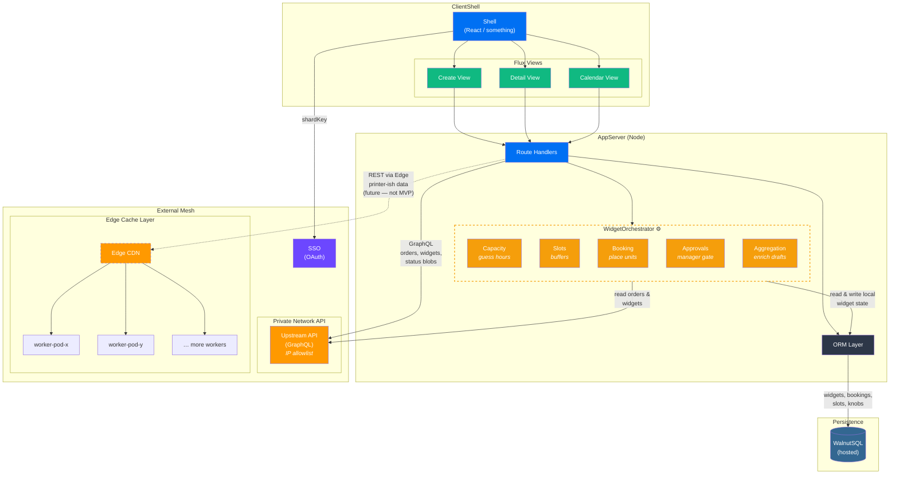
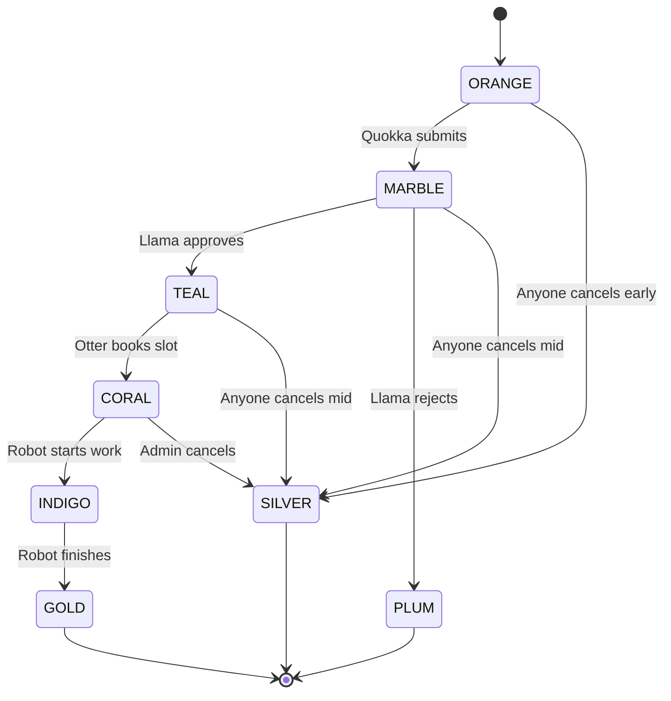

# Kestrel — sample system architecture (anonymized test fixture)

> **Note:** The dashed “WidgetOrchestrator” group is embedded in the app server in this fiction.

> **Note:** The “Edge Cache” path is a placeholder — MVP only talks to Upstream.

---

## Data ownership (anonymized)

| Owner | Storage | Data |
|---|---|---|
| **Local app** | WalnutSQL via ORM | Widgets, bookings, slot holds, knobs |
| **Upstream** | Private network | Orders, widgets, fulfilment blobs |
| **Edge workers** | On-prem → CDN | Capacity hints *(future)* |

## Data flow

| From | To | Protocol | Data |
|---|---|---|---|
| Shell | Routes | HTTP | Views hit routes |
| Routes | WidgetOrchestrator | Internal | Capacity math |
| Routes | Upstream | GraphQL | Orders / status |
| Routes | Edge | REST | Machine hints *(future)* |
| WidgetOrchestrator | WalnutSQL | SQL | Read/write local state |
| WidgetOrchestrator | Upstream | GraphQL | Read remote orders |

---

## WidgetOrchestrator

It pretends to:

- **Guess hours** for a widget run
- **Manage slots** with buffers
- **Book widgets** into slots
- **Approvals** with a manager gate
- **Aggregate** draft data from Upstream for the shell

## Auth

**SSOGate** with OAuth. Routes authenticate every call.

---

## Lifecycle (nonsense states)

> **Note:** `PLUM` is terminal but can be **cloned** into a fresh `ORANGE`.

| Hop | Who | Blurb |
|---|---|---|
| ORANGE → MARBLE | Quokka | Validates fields |
| MARBLE → TEAL | Llama | Approves |
| MARBLE → PLUM | Llama | Rejects with reason |
| TEAL → CORAL | Otter / Admin | Books slot with version check |
| CORAL → INDIGO | Robot | Production begins |
| INDIGO → GOLD | Robot | Production ends |
| * → SILVER | Mixed | Cancel path |

**Concurrency**: optimistic `version` column on rows.

---

## Upstream integration (fake)

- Static `API_TOKEN` header today
- Future: SSO JWT exchange

The sections below are generic placeholders about snapshots and caching — still markdown tables:

| Upstream status | Behavior |
|---|---|
| **OK** | Live fetch |
| **Slow (> 5s)** | Stale banner |
| **Down** | Snapshot only |

---

## Hosting blurb (trimmed)

| Constraint | Why |
|---|---|
| **Stable egress IP** | Allowlist |
| **Full SSR** | Auth on every page |
| **DB pool** | Connection limits |

### Comparison

| | Lambda-ish | PaaS | Containers |
|---|---|---|---|
| Egress | NAT | Paid feature | VPC |
| SSR | Yes | Yes | Yes |
